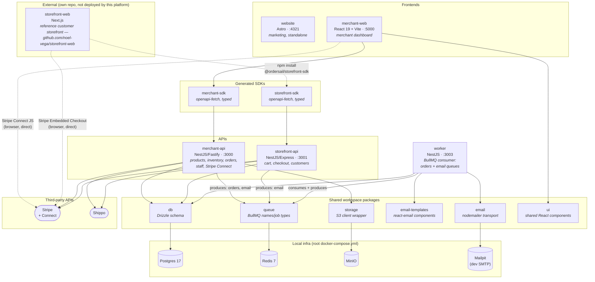
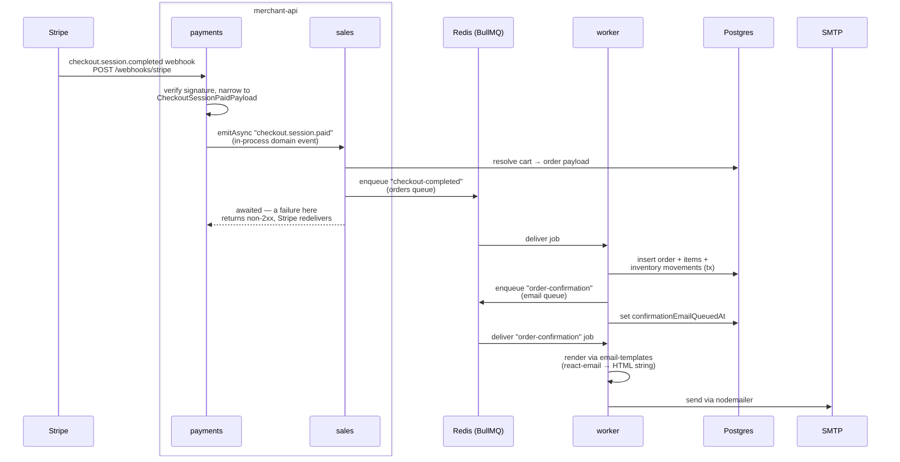

# Architecture

This is a system-level map of Ordersail: the apps, the shared packages, and the infra/third-party
services they depend on. It's generated from the current state of the code (including
in-flight, uncommitted work), not just what's in the [README](./README.md)'s architecture
table — notably `worker`, `queue`, `email`, `email-templates`, and `storage` aren't in that
table yet.

## System map

**Notes**

- No backend-to-backend HTTP traffic — `merchant-api` and `storefront-api` never call each
  other. The only inter-service calls are frontend → its own API, via a generated SDK.
- All three backend services (`merchant-api`, `storefront-api`, `worker`) expose an unauthenticated
  `GET /health` (database + Redis checks, via `@nestjs/terminus`). It's why `worker` listens on
  `:3003` at all now — it has no user-facing API, just this liveness signal for whatever orchestrator
  ends up running it. `worker`'s check also verifies each queue's consumption loop is actually
  draining a backlog, not just that Redis is reachable — a plain Redis ping can't tell the two apart
  (see the worker-reconnect-stall note in memory).
- Logging, correlation IDs, and how to trace a request across API → queue → worker:
  see [`docs/observability.md`](docs/observability.md).
- `website` is fully standalone: no workspace deps, no outbound calls, static marketing content.
- Every account is a tenant with its own Stripe Connect account — `merchant-api` and
  `storefront-api` both call Stripe directly (Connect onboarding vs. Checkout Sessions
  respectively), and both browser apps also load Stripe's JS SDK directly for card entry —
  that's the one place a frontend talks to a third party without going through its own backend.
- `email` (SMTP transport) and `email-templates` (rendering) are only ever imported by `worker`.
  The two APIs only ever *enqueue* email jobs via `queue` — they never touch SMTP.

## Order + email job flow

The multi-step async path from a paid Stripe checkout to a sent confirmation email, across the
`orders` and `email` BullMQ queues.

`merchant-api` owns the whole webhook-to-enqueue leg (moved off `storefront-api` in M9, OS-357).
Inside it the work crosses a context boundary: `payments` owns the Stripe surface and verifies the
event, `sales` owns the order and resolves the cart, and they meet at the in-process
`checkout.session.paid` domain event rather than a direct service call. `storefront-api` still
*creates* the Checkout Session, but no longer hears about its outcome.

The event is emitted with `emitAsync` and awaited, deliberately: the bus is in-process and not
durable, so if `sales` can't enqueue (Redis down, cart unresolvable) the webhook must return
non-2xx and let Stripe redeliver. A paid order is never silently lost. The enqueue's own
idempotency pre-check on `stripeCheckoutSessionId` makes that redelivery safe.

If `worker` dies between the order commit and the email enqueue, BullMQ's stalled-job
redelivery re-runs the job; the same idempotency check skips re-creating the order but still
retries the email (via the `confirmationEmailQueuedAt` flag) rather than losing it silently. An
order the worker ultimately can't write lands in `failed_orders`, retryable from the dashboard.

The same `email` queue also takes two simpler, single-step jobs enqueued directly by the APIs
(no `orders` queue involved): `staff-invite` from `merchant-api` and `customer-thank-you`
from `storefront-api`, both consumed by the same `worker` email processor.
